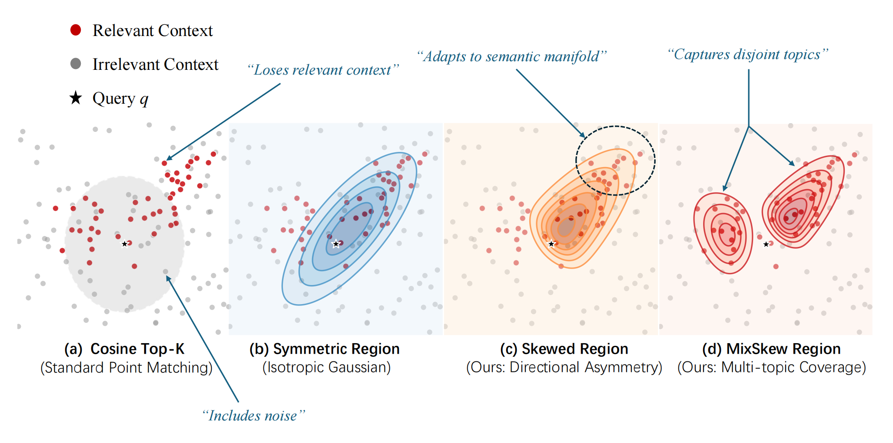
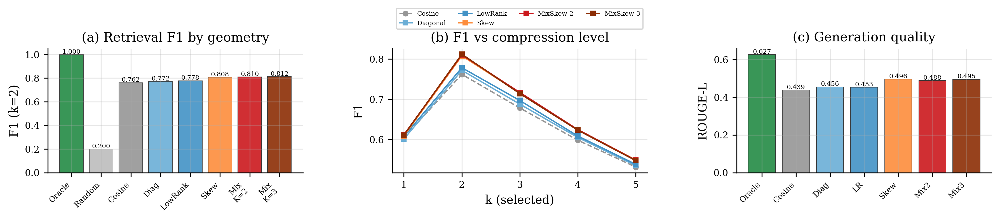
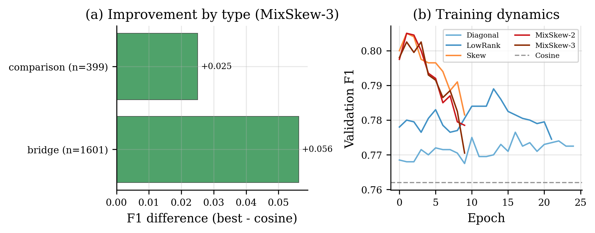
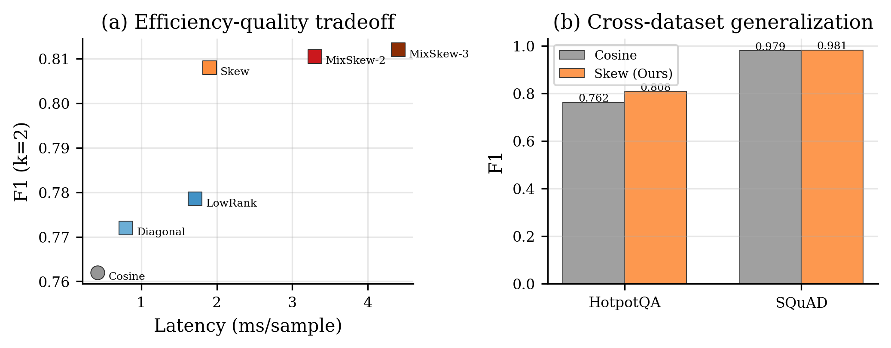

<div align="center">

# From Points to Regions

### Exploring Geometric Forms of Semantic Context Selection for LLM Compression

[](https://arxiv.org/abs/XXXX.XXXXX)
[](LICENSE)
[](https://python.org)
[](https://pytorch.org)
[](https://colab.research.google.com/)

**TL;DR:** We replace point-matching (cosine similarity) with *learnable geometric regions* for LLM context compression. A skew-Gaussian ellipsoid that adapts its shape to each query achieves **+5.0% F1** and **+13.1% ROUGE-L** over cosine Top-K on HotpotQA.

</div>

---

<p align="center">
  
</p>

<p align="center"><em>
Standard cosine Top-K treats all directions equally, losing relevant context and including noise.
Our approach learns query-adaptive geometric regions—from symmetric ellipsoids to skewed mixtures—that
align with the semantic manifold of relevant paragraphs.
</em></p>

---

## Key Findings

| Geometric Form | Shape | F1 (k=2) | Δ vs Cosine | ROUGE-L | Latency |
|:---|:---|:---:|:---:|:---:|:---:|
| Cosine Top-K | Sphere (point) | .762 | — | .439 | 0.4ms |
| Diagonal Gaussian | Axis-aligned ellipsoid | .772 | +1.0% | .456 | 0.8ms |
| Low-Rank Gaussian | Rotated ellipsoid | .779 | +1.7% | .453 | 1.7ms |
| **Skew-Gaussian** | **Skewed ellipsoid** | **.808** | **+4.6%** | **.496** | **1.9ms** |
| Mix-Skew K=2 | 2 skewed ellipsoids | .811 | +4.9% | .489 | 3.3ms |
| **Mix-Skew K=3** | **3 skewed ellipsoids** | **.812** | **+5.0%** | .496 | 4.4ms |

> All region methods significantly outperform cosine (p < 0.001, paired t-test, n=2000).

### Three key insights:

1. **Symmetry breaking is critical.** Going from symmetric to skewed ellipsoids nearly *triples* the gain (+1.7% → +4.6%), with only 0.5M additional parameters.

2. **Generation improvement exceeds retrieval improvement.** ROUGE-L improves by +13.1% relative, while F1 improves by +6.6%. Region-based selection captures semantically valuable paragraphs beyond what binary labels measure.

3. **The advantage grows with compression aggressiveness.** At k=2 (5× compression), the gap is largest—precisely where accurate selection matters most.

---

## Method

Given a query **q** and *N* context paragraphs, we replace cosine similarity scoring with a density-based score under a learned distribution:

```
score(cᵢ) = log p(f(cᵢ) | μ, Σ, α)
```

where **μ** (center), **Σ** (covariance), and **α** (skewness) are predicted by a lightweight MLP conditioned on the query embedding. The encoder (E5-large-v2) is frozen; only the predictor (~5M params) is trained.

### Geometric Progression

```
Point (Cosine)  →  Diagonal  →  Low-Rank  →  Skew  →  Mixture
     ●              ⬭           ⬮          ◗         ◗ ◗
  all dims       per-dim       dim         directional  multi-
  equal          weighting     interaction  asymmetry   center
```

Each step adds geometric expressiveness. The [paper](https://arxiv.org/abs/XXXX.XXXXX) includes a complete ablation chain showing which factors are necessary and why early configurations failed.

---

## Quick Start

### Installation

```bash
git clone https://github.com/Mr-wuff/From-Points-to-Regions-Exploring-Geometric-Forms-of-Semantic-Context-Selection-for-LLM-Compression.git
cd semantic-region-selection
pip install -r requirements.txt
```

### Run the Complete Experiment (Single GPU)

```bash
# Full Phase 2 experiment (recommended: A100, ~8 hours)
# Also runs on T4 with reduced training size
jupyter notebook phase2_comprehensive.ipynb
```

### Minimal Example

```python
import torch
from models import SkewGaussian

# Load pretrained predictor
model = SkewGaussian(embed_dim=1024, rank=16)
model.load_state_dict(torch.load('checkpoints/skew_hotpotqa.pt'))

# Score contexts against a query
query_emb = encoder.encode("Which band was founded earlier?")    # (1, 1024)
context_embs = encoder.encode(["paragraph 1", "paragraph 2", ...])  # (N, 1024)

scores = model.score(
    torch.tensor(query_emb).unsqueeze(0),
    torch.tensor(context_embs).unsqueeze(0)
)  # (1, N) — higher = more relevant

selected = scores[0].topk(k=2).indices
```

---

## Repository Structure

```
semantic-region-selection/
├── README.md
├── requirements.txt
├── LICENSE
│
├── assets/
│   ├── teaser.png              # Geometric forms illustration
│   ├── fig1_main_results.png   # Main results figure
│   ├── fig2_ablation_type.png  # Ablation & question type analysis
│   └── fig3_efficiency_cross.png  # Efficiency & cross-dataset
│
├── models/
│   ├── __init__.py
│   ├── diagonal.py             # M1: Diagonal Gaussian
│   ├── lowrank.py              # M2: Low-Rank Gaussian
│   ├── skew.py                 # M3: Skew-Gaussian
│   └── mixture.py              # M4/M5: Mixture of Skew-Gaussians
│
└── notebooks/
    ├── phase1a_initial.ipynb          # Initial attempt (instructive failure)
    ├── phase1b_ablation.ipynb         # Loss function & regularization ablation
    ├── phase1c_encoder_lowrank.ipynb  # Encoder upgrade + low-rank
    ├── phase1d_deep_exploration.ipynb # Hyperparameter optimization
    ├── phase1e_multidataset.ipynb     # Cross-dataset validation
    ├── phase1f_geometry.ipynb         # All geometric forms comparison
    └── phase2_comprehensive.ipynb     # Final comprehensive evaluation

```

---

## Experimental Journey

A unique aspect of this work is the **complete ablation chain from failure to success**, included as reproducible notebooks:

| Phase | Configuration | F1 | Δ | Outcome |
|:---:|:---|:---:|:---:|:---|
| 1A | MiniLM-384d + Diagonal + Margin loss | .620 | −1.8% | ❌ Regularizer explosion |
| 1B | + InfoNCE + clamping | .622 | −1.6% | ❌ Diagonal insufficient |
| 1C | + E5-1024d + Low-rank (r=8) | .790 | +0.8% | ✅ First success |
| 1D | + Temperature tuning + rank search | .792 | +1.9% | ✅ Optimized |
| 1F | + Skew-Gaussian | .810 | +3.7% | ✅ Symmetry breakthrough |
| **2** | **+ 20K training + MixSkew-3** | **.812** | **+5.0%** | **✅ Full potential** |

> Every failed configuration taught us something. Phase 1A revealed that forcing anisotropy via regularization backfires. Phase 1B showed diagonal covariance lacks expressiveness. These negative results are as valuable as the final success.

---

## Results at a Glance

<p align="center">
  
</p>
<p align="center"><em>Figure 1: (a) F1 by geometric form with Oracle/Random/Cosine baselines. (b) F1 across compression levels—advantage is largest at aggressive compression. (c) Generation quality (ROUGE-L) showing region methods consistently outperform cosine.</em></p>

<p align="center">
  
</p>
<p align="center"><em>Figure 2: (a) Bridge questions (+5.6%) benefit more than comparison (+2.5%) from region selection. (b) Training dynamics: skew/mixture models converge in 2-3 epochs.</em></p>

<p align="center">
  
</p>
<p align="center"><em>Figure 3: (a) Efficiency-quality Pareto frontier—Skew offers the best tradeoff. (b) Cross-dataset: strong gains on HotpotQA (multi-hop), minimal on SQuAD (near-perfect baseline).</em></p>

---

## Requirements

- Python ≥ 3.10
- PyTorch ≥ 2.0
- sentence-transformers
- transformers
- datasets (HuggingFace)
- rouge-score
- scipy, scikit-learn, matplotlib

```bash
pip install torch sentence-transformers transformers datasets rouge-score scipy scikit-learn matplotlib tqdm
```

**Hardware:** Experiments run on a single GPU. T4 (free Colab) works for preliminary experiments; A100 recommended for full-scale training (20K samples).

---

## Citation

If you find this work useful, please cite:

```bibtex
@article{wu2026points,
  title={From Points to Regions: Exploring Geometric Forms of Semantic Context Selection for LLM Compression},
  author={Wu, FeiFan},
  journal={arXiv preprint arXiv:XXXX.XXXXX},
  year={2026}
}
```

---

## License

This project is licensed under the MIT License — see [LICENSE](LICENSE) for details.

---

<div align="center">

**Questions or ideas?** Open an issue or reach out. We believe geometric approaches to semantic space have much unexplored potential—from richer non-Gaussian shapes to knowledge-anchored structures.

</div>
